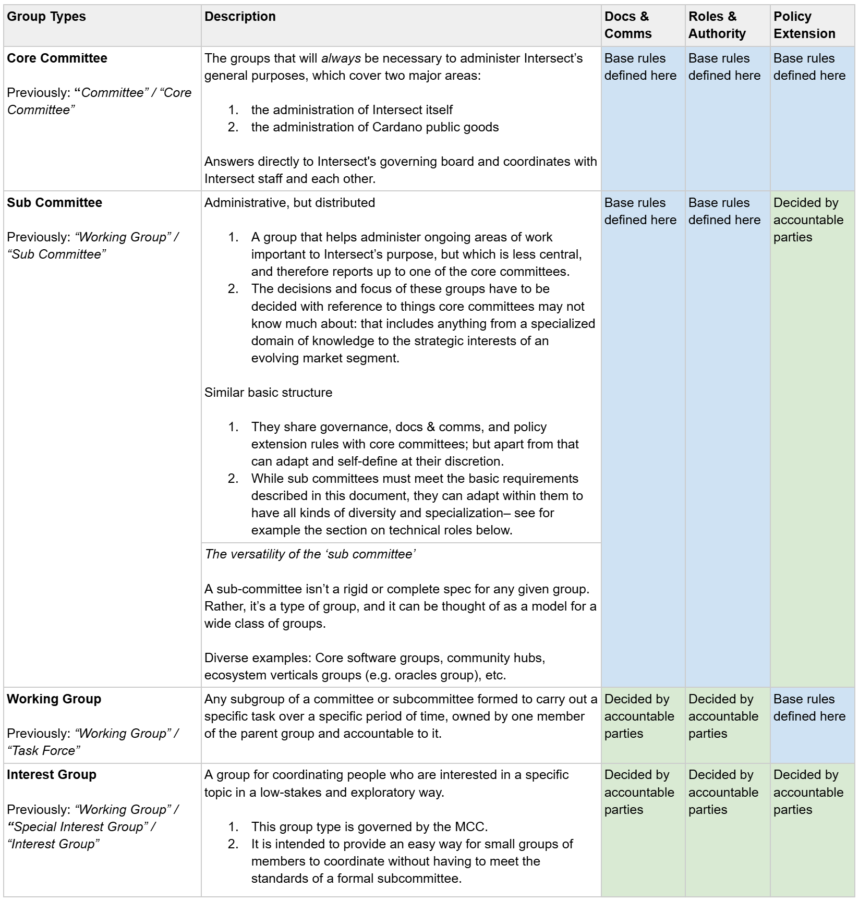

# Basic Policy Framework (WIP)


ATTENTION - This page is a work in progress (WIP), and although it represents the input of people across Intersect membership and staff, as well as a long and careful design process, it does not describe the present state of Intersect policy.&#x20;

In particular "subcommittee" is a concept Intersect may need (it is essentially a group that functions like a committee and reports to a core committee)-- however it is not presently implemented.&#x20;

This document is intended to give people the chance to provide input and move in a common direction, but it won't be valid as basic policy until the WIP label is removed.&#x20;

FEEDBACK - The MCC would love to get your input on the basic policy for Intersect groups as defined here: input [form](https://forms.gle/hA4oXBwaAyHFqcK87).&#x20;


## Definition of Terms

<figure><figcaption></figcaption></figure>

### How Basic Policy Works

**A central policy for distributed decision-making:**

This document defines the fewest possible rules for a general framework so that decisions and policy can be set and adapted by the people closest to them

If there are no rules for something in this document, it **does not** mean that it is unimportant OR that it is forbidden. Rather, it means that it’s best to leave those policies or decisions to the group in question. Every group, in turn, _is governed_ by some basic rules defined in this document: at the very least, they are accountable to the Intersect organizational hierarchy, and by extension, to groups governed by this document.

If there _are_ rules for something here, their purpose is to define the minimum structure for further deliberation, interpretation, judgment, and accountability.

The rules here are as light as possible in order to be conducive to good decision-making and good work.

**Policy Extension**

While they must honor the rules set in the general framework, parties accountable for decision-making in any group can use the powers granted them by the basic framework to extend it with specialized policy.

_Example_ - For instance, the maximum number of voting members in basic policy is set at 7. However, if a group would like to function with more voting members, those initial members can vote to operate on a policy where more people can vote.

**Policy Reversion**

There are two limits on extensibility–

1. Extensions of the basic policy must leave a way for the basic roles defined in this document to \*unilaterally revert policy settings to the defaults defined in this document. There is a basic provision to this effect in the key decisions section below.&#x20;
2. Each group remains accountable for its decisions to the next group higher in the hierarchy; ultimately, a parent group can dissolve a child group if necessary. However, this fact incentivizes cooperation and consensus-making.

_Example_ - To return to the member maximum example, because of the reversibility requirement, 7 member seats must retain at least the special power to vote to revert to the default policies, if they believe it is necessary for the purpose of the group.

\*i.e. relying only on the roles and policies defined in this doc, without relying on any of the extended policies or roles.

### Initial Qualification

**Note** - The governance action involved in the formation of sub committees is described in section #5.

<figure><figcaption></figcaption></figure>

### Ongoing Qualification

<figure><figcaption></figcaption></figure>

## Group Qualification Criteria

**Note** - this applies formally only to Committees and Sub-Committees, although it may be used as an informal touch-stone when vetting Interest Groups and Sub-Committees.&#x20;

<figure><figcaption>
(continued below)
</figcaption></figure>

<figure><figcaption></figcaption></figure>

## Communication and Documentation Standard

This document represents the minimum requirements for the comms and docs of Sub-Committees and Committees.

* This framework ensures the basic visibility required for subcommittees to maintain legitimacy and earn the support they deserve.&#x20;
* This framework is intended to serve stakeholders that are both internal to Intersect and external, in the Cardano ecosystem.

**Communications**

<figure><figcaption></figcaption></figure>

<figure><figcaption></figcaption></figure>

**Infrastructure**

<figure><figcaption></figcaption></figure>

To use as an aid: [Monthly Checklist - Minimum stakeholder relations](https://docs.google.com/document/d/1NYK2xp46Rzusu4I_tJlYljSdXPlhVOBzS-12PJDMRbw/edit)

**Principles**

1. Public governance and public work
   * All group proceedings (i.e. where decisions can be made) are open to all members.
   * All group work is documented in an accessible format to all members
2. Single source of truth
   * All communications are accessible via one or two clicks from the group’s gitbook site.
3. Membership transparency
   * Group members agree to be identified by name or pseudonym in the group communications discussed in this document.

## Group Governance

**Hierarchy**

The accountability chain and specific responsibilities of the Basic Policy Framework itself.

<figure><figcaption></figcaption></figure>

**Key Decision-Making Processes**

This represents the minimum governance structure of committees and subcommittees.&#x20;

<figure><figcaption></figcaption></figure>

<figure><figcaption></figcaption></figure>

**Checks and Balances**

The default governance mode of Committees and Subcommittees is consensus-based executive leadership, constrained by the consent of a quorum of voting members. Decisions are always provisional until the chair has given the members to call a vote if they wish.&#x20;

This makes the chair work out a natural balance for calling votes on his/her own initiative on the one hand, and on the other simply driving things forward where there is basic consensus. If the chair is mistaken, he/she can be checked by any member who suggests the action be put to a vote. See “decision brass tack rules” above.

### Why this governance structure?  

**Decision making** - Decisions are the primary output of a committee; it maintains and dispenses authority to act on shared problems through these decisions. For that reason, committees are structured to create consensus-based decisions, with legitimate and effective authority:

1. legitimate authority
   * endorsed by a consensus of peer contributors (voting members of the committee)
   * responsive to the voices of stakeholders (through feedback mechanisms described in this doc)
2. effective authority
   * those with the power to execute work with the committee (through its working groups)
   * stakeholders with unmet needs appeal to the committee (through feedback mechanisms described in this doc)

**Drawing on working groups** - Committees are **not** structured to execute work: their members are selected for the legitimacy and effectiveness they lend to its decisions, not willingness to take work assignments, and their proceedings are optimized for consensus, rather than execution. For this reason, if committees need something done, they must make the decision to empower an individual person or entity to execute an agreed remit of work through a _working group_– this can be as simple as delegating authority for a few hours of work to a member volunteer, as complex as soliciting a paid contract for a large software project, or anything in between.

This document explains the key information needed to make your committee a legitimate and effective source of authority, and to provide clarity and confidence to your stakeholders.

## Membership and Roles

**Accountability, Authority, and Time Commitment**

<figure><figcaption></figcaption></figure>

<figure><figcaption></figcaption></figure>

_Explanatory Note_ - Why identify a single individual with ultimate accountability for decision-making, the chair in committees and the lead in working groups?&#x20;

Having a single person responsible for accomplishing something is the only efficient way to make it happen. “Work by committee” is notoriously ineffective. What committees do well on the other hand is provide a deliberative body and accountability structure. That is why committee members can vote on decisions presented to them by the chair, or to veto the chair’s provisional decisions if necessary; and it’s why a working group lead has authority to make executive decisions, but is constrained by the remit provided by the committee and accountable to it.

**Appointments and Dismissals**

<figure><figcaption></figcaption></figure>

### Specialized Roles & Policy

The subcommittees of technical projects “Project Management Committees” need some special terminology to match their technical functions as well as pre-existing language and culture.&#x20;

Each of the technical roles described below corresponds to one of the standard governance roles discussed in the section #5 on “Group Governance” above. This means that it has at least the same basic governance structure.&#x20;

**Exception** - The one exception is Committer / Maintainers. There is a maximum of 7 formal voting members per subcommittee. Subcommittees can choose to make any committer that is not a formal voting member an informal voting member. This just means that in times of emergency, authority falls back on the 7 formal voting members.&#x20;

Additionally, what are referred to elsewhere as Project Management Committees (PMCs) are subcommittees, according to the definitions and policies of this general framework.

<figure><figcaption></figcaption></figure>

For further information, please reference: [https://intersect.gitbook.io/open-source-committee/policies/governance#development](https://intersect.gitbook.io/open-source-committee/policies/governance#development) for a fantastic definition of these roles and their responsibilities from a technical project management perspective.

## Processes for Interest Groups

Interest groups serve to coordinate interest in a specific topic, with as little formal structure as possible. They are by default easy to create and convenient to run.

**Creation**

Creation requires only a simple application and quick check by the MCC. The application includes the following:

1. a brief description of the interest of the group.
2. the contacts of at least four members who support the group’s creation.
3. Assent to the moderation agreement.&#x20;
4. Assent to conducting the group in line with the Intersect code of conduct and Intersect's mission statement

**Structure**

What does an interest group actually consist of?

1. A simple form to become a member of the interest group
2. A discord channel for members
3. A discord role for members
4. An email list for members

This is intended to provide the simplest possible experience for basic coordination of Intersect members along a specific vector of interest.&#x20;

**Functions**

1. Communications: the interest group discord @ and email list are accessible by the secretaries of the committees, and also by the interest group admin.
2. Meetings and other coordination: Left up to the initiative of members who can apply for admin privileges in order to organize informally on a voluntary basis.

**Governance**

Interest groups are administered informally by a committee of the MCC.&#x20;

The only role within an interest group is Interest Group Admin, which allows a member to take a more active role in organizing other members of the group. This role has special access to the Intersect’s infrastructure, to organize with other members at their own initiative.&#x20;

1. Admins are automatically non-voting members of the MCC’s Interest Groups Subcommittee.
2. Admins are appointed by the MCC; anyone can apply to be an admin, if they assent to the moderation agreement (link pending).
3. Admins only responsibilities are to not violate a set of guidelines, namely the following:
   * Intersect’s membership agreement or purpose and to assent to the moderation agreement.

